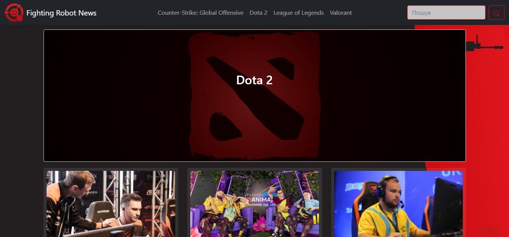
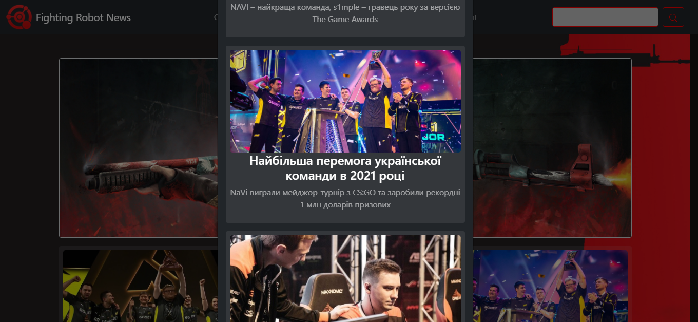
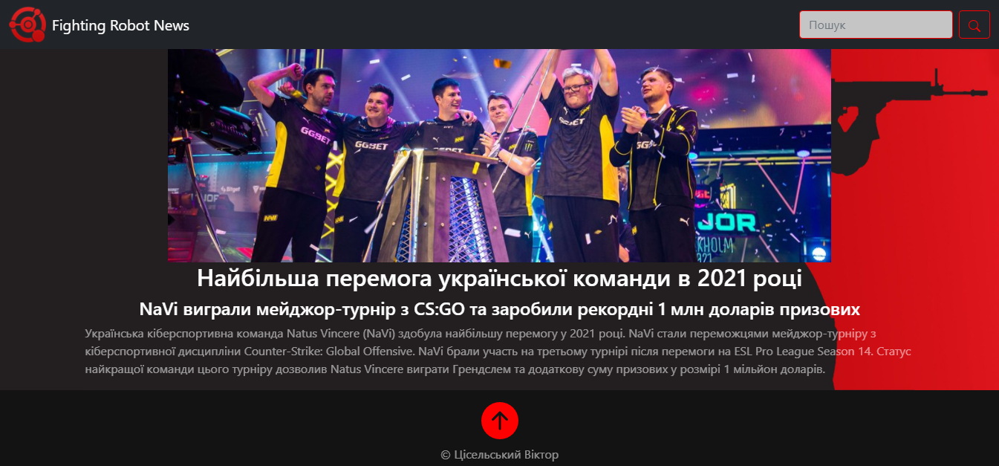
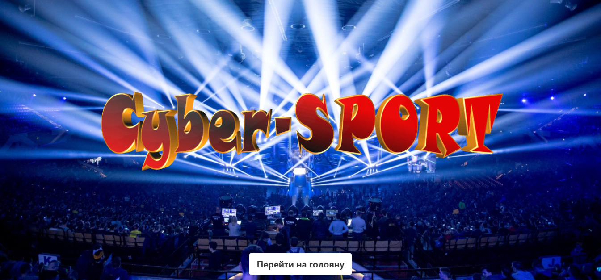
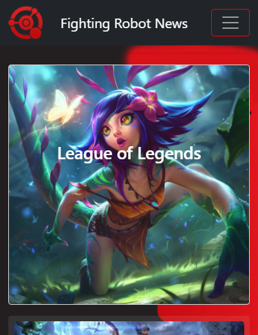
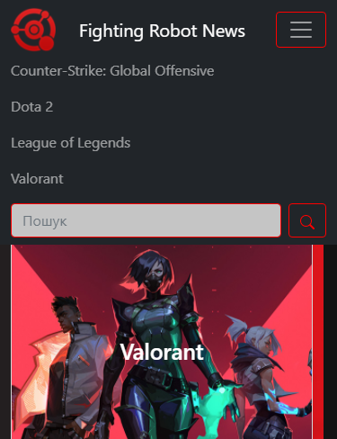
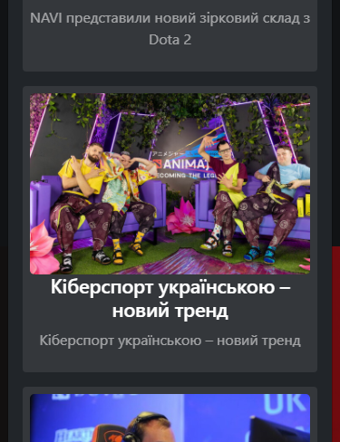
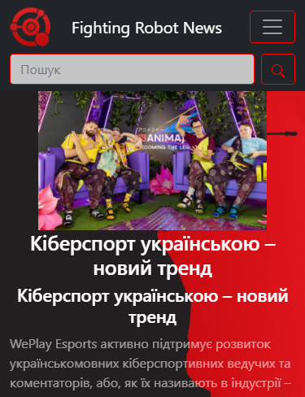

<p align="center"></p>
<h1 align="center">Fighting Robot News</h1>

## Description
<b>EN:</b>

This is a course project that I was ordered.

The project visualizes the work of a news website on the topic of eSports. Without using an **API**, just a front end for now.

<b>UA:</b>

Це курсовий проект який в мене заказали.

Проект візуалізує роботу новинного сайту на тему кіберспорту. Без використання **API**, поки що лише інтерфейс.

#
## Screenshots
<p>
  
  
  
  
</p>
<p>
  
  
  
  
</p>

#
## Technologies used
<b>EN:</b>
- Using **Bootstrap** (front-end framework)
- Data storage in files in **JSON** format (without using the **API**)
- Search for information and navigation on the site

<b>UA:</b>
- Використання **Bootstrap** (front-end framework)
- Зберігання даних у файлах у форматі **JSON** (без використання **API**)
- Пошук інформації та навігація по сайту

#
## License
```
© 2022, CoolOtaku (ericspz531@gmail.com)
```
